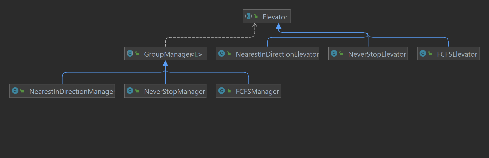
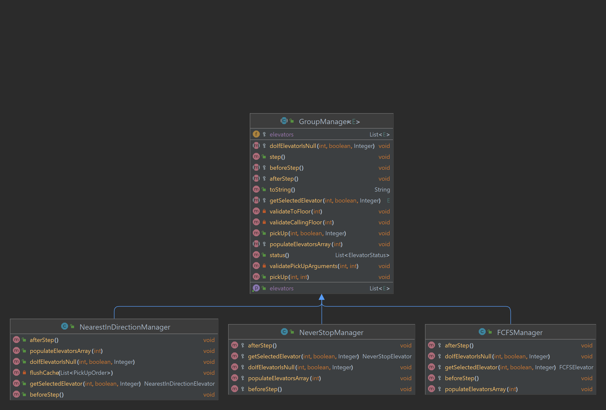
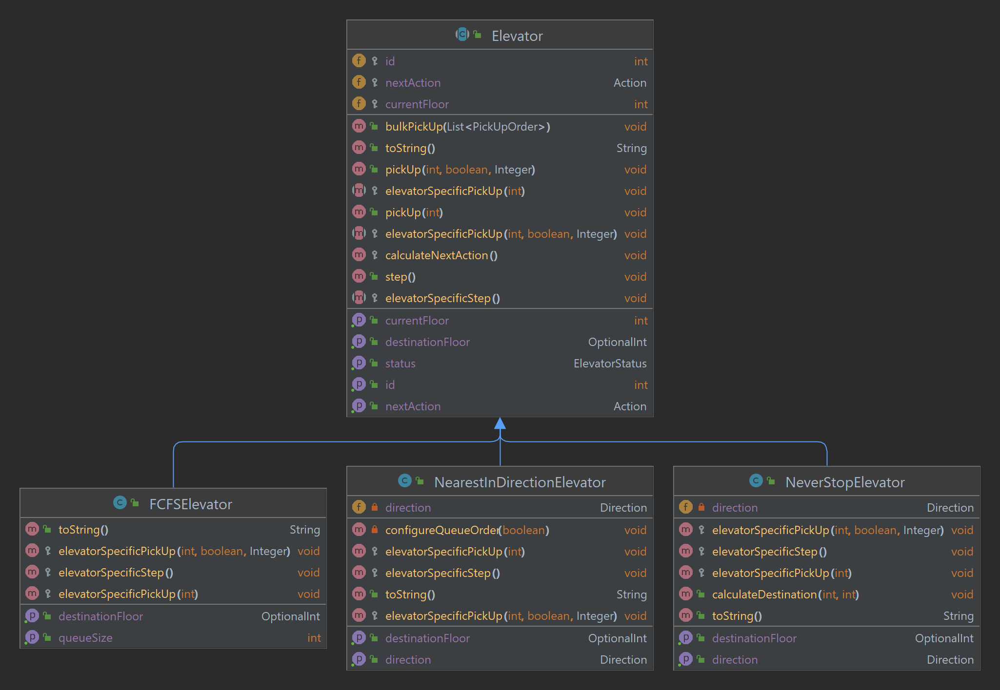

# Elevator-System

This repository contains CLI simulator of Elevator system.

Application can by run be executing the `main` method inside the `App` class, or by running the following commands:
```bash
$ mvn compile
$ mvn exec:java -Dexec.mainClass=org.example.App
```

## Scheduling strategies
There are 3 different orders scheduling strategies available in the app:
- `NeverStop` - paternoster like elevator system. The elevator of that type stops on every floor no matter if there is or isn't someone waiting on that floor.
- `FCFS` - First Come, First Served system. Before executing next inquiry an elevator must first complete the current one.
- `NearestInDirection` - system looks for the nearest elevator which goes in the direction of the user's inquiry and stops only on floors where someone wants to get in or get out.

### Mapping of real live example into simulation


## Class diagrams

### General


- `Elevator` - abstract class containing all basic elevator methods.
  - `NeverStopElevator`, `FCFSElevator`, `NearestInDirectionElevator` - implementations
- `GroupManager` - abstract class meant to represent a group of elevators of the same type, having the same configuration, and sharing a pickup queue
  - `NeverStopManager`, `FCFSManager`, `NearestInDirectionManager` - implementations

### GroupManager


### Elevator 

